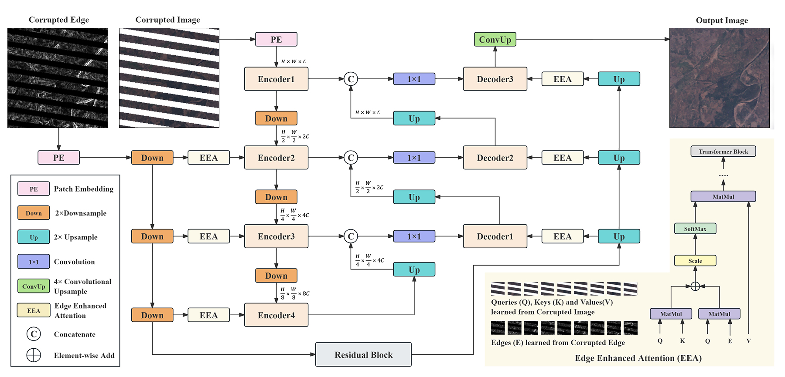
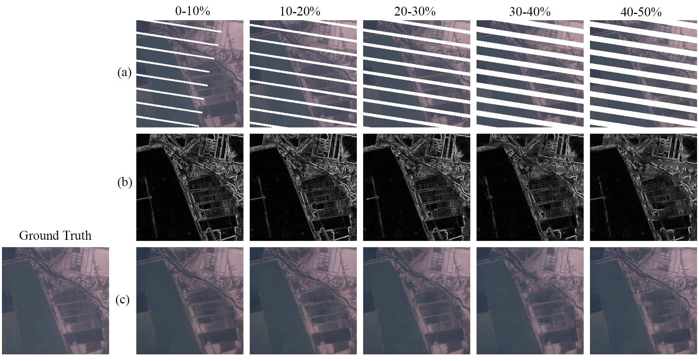
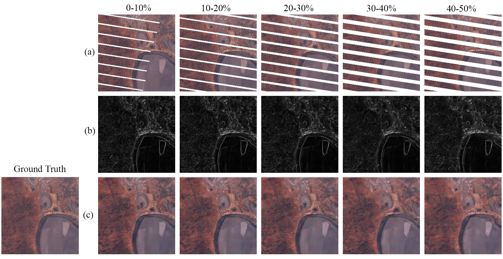
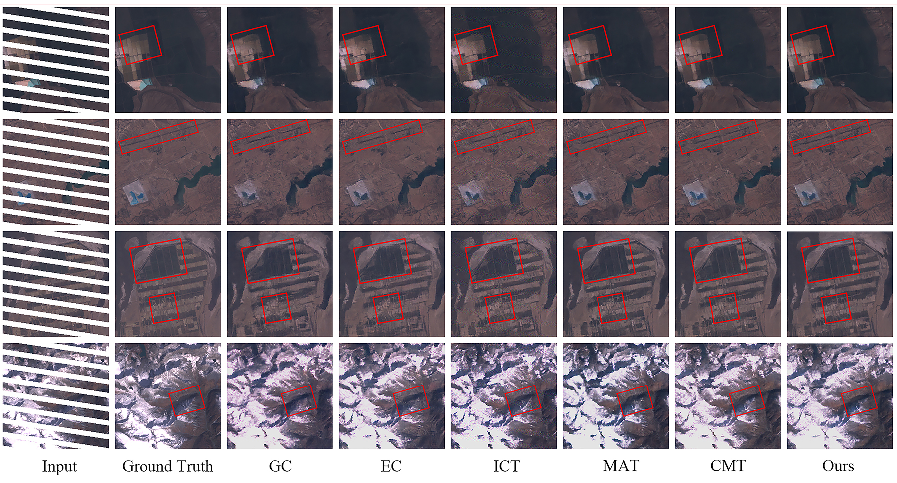
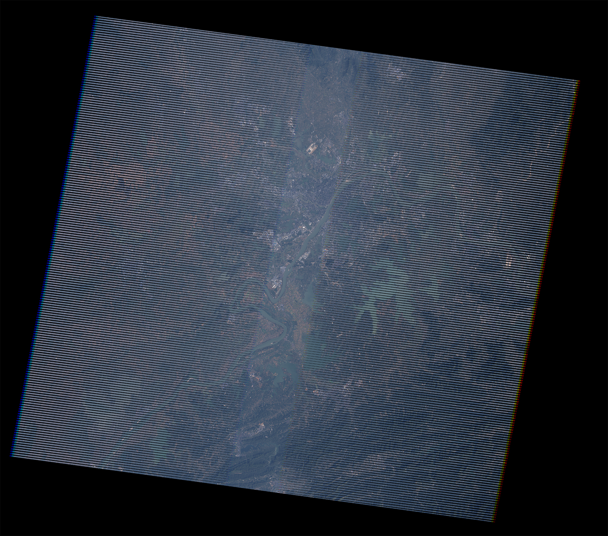
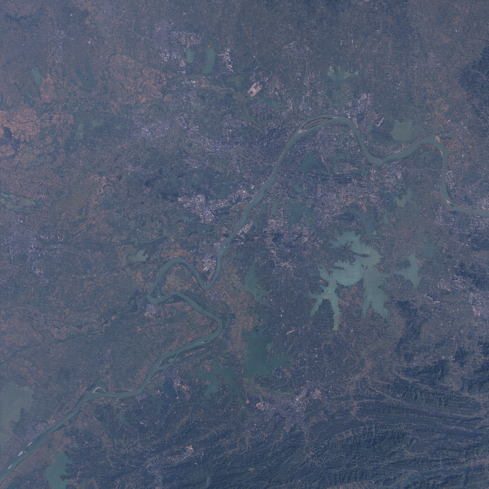

# Landsat-7 ETM+ Image Inpainting with Edge-Enhanced Transformer

This repository contains the implementation of the research paper "Landsat-7 ETM+ Image Inpainting with Edge-Enhanced Transformer". The paper is currently under submission.

## Introduction

Landsat-7 ETM+ images consistently suffer from sensor striping, resulting in incomplete satellite imagery. Our Edge-Enhanced Transformer (EET) integrates geomorphological edge information into the self-attention mechanism, enabling better inpainting of key structures and high-frequency details. The method supports large-scale inpainting of 5120×5120 images, using overlapping splitting and mirror padding to avoid the chessboard effect.

## Requirements

Python >=3.6

PyTorch >=1.6

NVIDIA GPU + CUDA cuDNN

## Installation

1. Clone the repository:

   ```git clone https://github.com/Chowdz/landsat-7_eet.git```

   ```cd landsat-7_eet```

2. Install dependencies:

   ```pip install -r requirements.txt```

## Pipeline



## Dataset

we downloaded a dataset of 1,000 satellite images from the LANDSAT/LE07/C02/ T1\_TOA collection through [Google Earth Engine (GEE) API](https://doi.org/10.1016/j.rse.2017.06.031), covering regions including Africa, South America, Southeast Asia, Oceania, and Central Asia. These images were collected from non-polar regions between latitudes 60°S and 60°N before May 31, 2003, each cropped from the geometric center to dimensions of $5120\times5120$, a spatial resolution of 30 meters, and comprising 8 bands. To ensure cleaner ground truth images, the dataset was curated to include satellite images with cloud coverage below 1\%. For our study, we focused on bands B1, B2, and B3 only, with visualization parameters mapping pixel values between 0-0.4 and applying a gamma correction of 1.4. Each satellite image was segmented into 400 images of $256\times256$ pixels, covering approximately 38 $km^2$ each, resulting in a dataset of 400,000 images with uniformly distributed geomorphological features. Our masks were generated using the QA\_RADSAT missing pixel layer from the Landsat-7 ETM SLC-OFF dataset. They are single-channel binary layers and were processed with the same tiling method and spatial resolution as the satellite image data.

## Training

1. Start:

   ```python trainer.py --batch_size 10 --epoch 1 --n_epoch 500 --lr 0.0005 --beta1 0.95 --beta2 0.9995 --train_img_root 'home/train' --train_mask_root 'home/mask' --train_result_root 'home/result/' --save_model_root 'home/models/' --img_size 256 --in_c 4 --out_c 3 --patch_size 4 --embed_dim 64 --depth [1, 2, 3, 4] --num_heads [1, 2, 4, 8] --adv_loss_weight 1 --per_loss_weight 0.5 --sty_loss_weight 10000 --l1_loss_weight 100 --sobel_loss_weight 80 --sample_interval 500```

   Note: The --train_img_root and --train_mask_root parameters refer to the folders containing Landsat-7 ETM+ training satellite images and missing pixel masks, respectively. Each image in these folders should already be cut into 256×256 patches.

2. Tensorboard:

   ```tensorboard --logdir=logs```

## Result

<p align="center">
    
    <p>Figure 1: Inpainting results under different mask sizes</p>
</p>

<figure style="text-align: center;">
  
  <figcaption>Figure 2: Inpainting results2 under different mask sizes</figcaption>
</figure>


<figure style="text-align: center;">
  
  <figcaption>Figure 3: Comparison results</figcaption>
</figure>


## Real Application


### Functionality:

- Automatically downloads and loads the pre-trained model. If you need to download it separately, you can do so from this [EET](https://drive.google.com/uc?export=download&id=1yon1mfSKmjiEAsK-MTebKZclp1GoZj99).
  
- Loads the landsat-7 ETM+ corrupted satellite image from the specified input path.
  
- Uses a generator model to repair the damaged image.
  
- Saves the inpainting image to the specified output folder.


### Output:

The inpainting satellite image will be saved in the specified output folder as two files:

- 'inpainting.tif': The repaired satellite image.

- 'ground_truth.tif': The original damaged image (for comparison).

  

### Raises:

ValueError: If input_path is not a file or output_path is not a directory.


### Steps:

1. ```cd landsat-7_eet```

2. ```python main.py --INPUT_IMG_PATH '/home/user/dataset/CorruptedImage.tif' --OUTPUT_IMG_PATH '/home/user/dataset/InpaintingImages/' --VIS_PARAM {'min': 0, 'max': 0.4, 'gamma': 1.4}```

   

### Note:

- INPUT_IMG_PATH(str): Path to the input landsat-7 ETM+ corrupted satellite image, specified to the image file.

- OUTPUT_IMG_PATH(str): Path to the folder where the inpainting satellite image will be saved. The output image will be saved as 'inpainting.tif' and 'ground_truth.tif'.

- VIS_PARAM (dict, optional): Visualization parameters to adjust the display of the input satellite image. This parameter is not recommended for default use.Only use if the downloaded satellite image has not been adjusted for visualization. Suggested parameters: vis_param = {'min': 0, 'max': 0.4, 'gamma': 1.4}

### Application Results Display:


<figure style="text-align: center;">
  
  <figcaption>Figure 4: Input</figcaption>
</figure>


<figure style="text-align: center;">
  
  <figcaption>Figure 4: Output ground truth</figcaption>
</figure>


<figure style="text-align: center;">
  
  <figcaption>Figure 5: Output inpainting</figcaption>
</figure>


## License

This project is licensed under the MIT License - see the [LICENSE](LICENSE) file for details.

## Contact

Feel free to contact us via email [dazhizhou18@gmail.com](dazhizhou18@gmail.com) or GitHub Issues for questions, feedback, or contributions to this project. We appreciate your interest!
